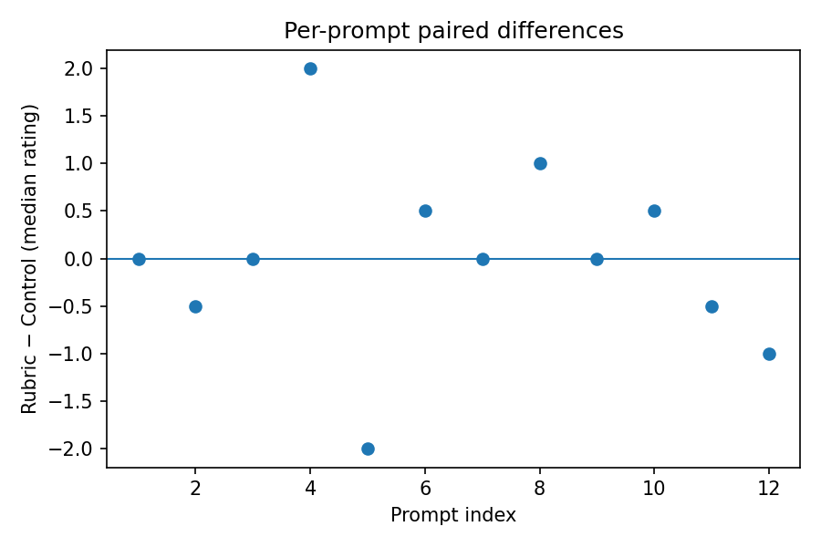

# LLM Evaluation Mini — Reliability & Oversight

## Why this exists
This repo shows how to evaluate feedback quality using rubric-aligned ratings,
with transparent stats and a single reproducible script.

## Repo layout
```
llm-eval-mini/
├─ data/
│  ├─ prompts.csv                 # toy prompt IDs + text
│  ├─ ratings_control.csv         # mock 7-point ratings per prompt by rater for the control chatbot
│  └─ ratings_rubric.csv          # mock 7-point ratings per prompt by rater for the rubric-anchored chatbot
├─ src/
│  ├─ eval/metrics.py             # Wilcoxon (paired), rank-biserial, Krippendorff's alpha (interval)
│  └─ pipeline/run_eval.py        # loads data, aggregates, runs stats, saves plot + report
├─ notebooks/
│  └─ quickstart.ipynb            # walk-through (load → aggregate → test → plot)
├─ scripts/
│  └─ generate_mock_outputs.py    # re-generate synthetic ratings with a modest rubric advantage
├─ reports/                        # created on first run
├─ LICENSE
├─ requirements.txt
└─ README.md
```

## Quickstart
1) Create a virtual environment (recommended) and install:
```bash
pip install -r requirements.txt
```
2) Run the evaluation:
```bash
python -m src.pipeline.run_eval
```
3) Open the outputs:
- `reports/summary.tsv`
- `reports/delta_plot.png`

## Methods (brief)
- **Paired design:** Each prompt is rated under both conditions → paired Wilcoxon signed-rank on per-prompt medians.
- **Effect size:** Rank-biserial correlation `r_rb` and `r = Z / sqrt(N)`.
- **Reliability:** Krippendorff's alpha (interval) across raters per condition.

### Example Results (Synthetic Data)

Running the demo with mock ratings produces reproducible outputs:

| Metric | Value | Interpretation |
|:--|:--:|:--|
| n_prompts | 12 | paired comparisons |
| Krippendorff’s α (control / rubric) | 0.486 / 0.098 | moderate vs. low inter-rater reliability |
| Wilcoxon Z | –0.08 | near zero difference |
| p (two-sided) | 0.94 | not significant (expected for synthetic data) |
| Median Δ | 0.0 | identical medians |



These results confirm the pipeline runs end-to-end and outputs reliability metrics and visualizations.  
When replaced with real ratings, the same analysis quantifies rubric anchoring effects on clarity, actionability, and reliability.

## Key Features
- **Reproducible pipeline:** single script → same outputs every run (seeded random generator).
- **Transparent metrics:** Wilcoxon (paired), rank-biserial, Krippendorff’s α (interval).
- **Modular design:** metrics in `src/eval/`, pipeline in `src/pipeline/`, easy to extend for new datasets.
- **CI-ready:** includes `pytest` + GitHub Actions workflow for automated verification.
- **Auto-reporting:** saves TSV summary and Matplotlib plot for instant interpretability.

## Extending / Customizing
To use your own data:
1. Replace `data/ratings_control.csv` and `data/ratings_rubric.csv` with your ratings (7-point scale, one row per prompt × rater).
2. Edit `data/prompts.csv` to match your items.
3. Run `python -m src.pipeline.run_eval` — all downstream scripts, plots, and summaries update automatically.

Add new metrics:
- Drop a function into `src/eval/metrics.py`.
- Register it in `src/pipeline/run_eval.py` to include in reports.

## Automated Tests & CI
- Unit tests for all metrics under `tests/test_metrics.py` (`pytest`).
- GitHub Actions workflow runs tests + evaluation on every push.
- Example status badge:


## Notes
- This repo uses synthetic example data; replace with your own ratings to run real analysis.
- No external APIs required.
- Charts use Matplotlib with default styles and single plots as required.
